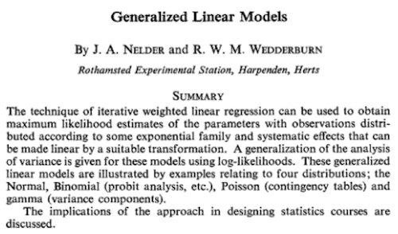

```{r setup, include=FALSE}
knitr::opts_chunk$set(echo = FALSE, comment = NA, warning = FALSE, message = FALSE)
library(knitr)
hook_output = knit_hooks$get('output')
knit_hooks$set(output = function(x, options) {
  # this hook is used only when the linewidth option is not NULL
  if (!is.null(n <- options$linewidth)) {
    x = knitr:::split_lines(x)
    # any lines wider than n should be wrapped
    if (any(nchar(x) > n)) x = strwrap(x, width = n)
    x = paste(x, collapse = '\n')
  }
  hook_output(x, options)
})
glmModelPlot <- function(x, y, xlim,ylim, meanPred,  LwPred, UpPred, 
                         plotData, main=NULL){
  ## Based on code by Arthur Charpentier:
  ## http://freakonometrics.hypotheses.org/9593
  n <- 2
  N <- length(meanPred)
  zMax <- max(unlist(sapply(plotData, "[[", "z")))*1.5
  mat <- persp(xlim, ylim, matrix(0, n, n), main=main,
               zlim=c(0, zMax), theta=-30, 
               ticktype="detailed",box=FALSE)
  C <- trans3d(x, UpPred, rep(0, N),mat)
  lines(C, lty=2)
  C <- trans3d(x, LwPred, rep(0, N), mat)
  lines(C, lty=2)
  C <- trans3d(c(x, rev(x)), c(UpPred, rev(LwPred)),
               rep(0, 2*N), mat)
  polygon(C, border=NA, col=adjustcolor("yellow", alpha.f = 0.5))
  C <- trans3d(x, meanPred, rep(0, N), mat)
  lines(C, lwd=2, col="grey")
  C <- trans3d(x, y, rep(0,N), mat)
  points(C, lwd=2, col="#00526D")
  for(j in N:1){
    xp <- plotData[[j]]$x
    yp <- plotData[[j]]$y
    z0 <- plotData[[j]]$z0
    zp <- plotData[[j]]$z
    C <- trans3d(c(xp, xp), c(yp, rev(yp)), c(zp, z0), mat)
    polygon(C, border=NA, col="light blue", density=40)
    C <- trans3d(xp, yp, z0, mat)
    lines(C, lty=2)
    C <- trans3d(xp, yp, zp, mat)
    lines(C, col=adjustcolor("blue", alpha.f = 0.5))
  }
}
```

## Agenda

Generalized linear models (GLMs) are a flexible generalization of linear models, with applications in many disciplines. 

This talk will give an introduction to GLMs from a distribution-centric point of view. 

Using a small toy data set we will discuss how different assumptions about the data generating process lead to different assumptions about the distribution of the data (response variable) and therefore different GLMs. 

## The problem GLMs solved

 - Fitting data from distributions other than Normal distributions
 - First published in 1972 by John Nelder and Robert Wedderburn, as a unifying approach for many different distributions
 
## Original Abstract



## The original authors of GLM


## Example problem: Selling ice cream


## The challenge

 - Create a model that predicts the number of ice creams sold for different temperatures
 - Ensure model behaves well when the temperature drops to 0ºC and for a very hot summer's day at 35ºC. 

## Available data

```{r icecream, echo=TRUE}
icecream <- data.frame(
  temp=c(11.9, 14.2, 15.2, 16.4, 17.2, 18.1, 
         18.5, 19.4, 22.1, 22.6, 23.4, 25.1),
  units=c(185L, 215L, 332L, 325L, 408L, 421L, 
          406L, 412L, 522L, 445L, 544L, 614L)
  )
```

## Plot of ice cream data

```{r icecreamPlot}
basicPlot <- function(...){
  plot(units ~ temp, data=icecream, bty="n", lwd=2,
       main="Number of ice creams sold", col="#00526D", 
       xlab="Temperature (Celsius)", 
       ylab="Units sold", ...)
  axis(side = 1, col="grey")
  axis(side = 2, col="grey")
}
basicPlot()
```

## Use a ruler and pencil 

```{r}
lsq.mod <- lsfit(icecream$temp, icecream$units)
basicPlot()
abline(lsq.mod, col="orange", lwd=2)
legend(x="topleft", bty="n", lwd=c(2,2), lty=c(NA,1),
       legend=c("observation", "linear least square"),
       col=c("#00526D","orange"),  pch=c(1,NA))
```

# Model 1: Gaussian GLM

## Linear regression

Let's start with a probability distribution centric description of the data. 

I believe the observation \(y_i\) was drawn from a Normal distribution with 
a mean \(\mu_i\), depending on the temperature \(x_i\) and a constant 
variance \(\sigma^2\) across all temperatures. 
\begin{align}
y_i & \sim \mathcal{N}(\mu_i, \sigma^2), \\ 
\mathbb{E}[y_i] & = \mu_i = \alpha + \beta x_i \; \text{for all}\; i
\end{align}

The first equation describes the distribution of the response and the second equation how  the distribution parameter \(\mu_i\) is linked in a linear way.

## Model 1: Gaussian GLM

```{r glmGaussian, echo=TRUE, message=FALSE, warning=FALSE}
library(arm) # for 'display' function only
lin.mod <- glm(units ~ temp, data=icecream, 
              family=gaussian(link="identity"))
display(lin.mod)
```

## Model 1: Gaussian GLM Plot

```{r NormalModelPlot, fig.height=5, fig.cap="\\(y_i \\sim \\mathcal{N}(\\mu_i, \\sigma^2) \\text{ with } \\mu_i =  -159.5 + 30.1 \\, x_i \\text{ and } \\sigma = 38.1\\)"}
xlim <- c(min(icecream$temp)*0.95, max(icecream$temp)*1.05)
ylim <- c(floor(min(icecream$units)*0.95),
          ceiling(max(icecream$units)*1.05))

meanPred <- predict(lin.mod, type="response")
sdgig <- sqrt(summary(lin.mod)$dispersion)

UpPred <- qnorm(.95, meanPred, sdgig)
LwPred <- qnorm(.05, meanPred, sdgig)

plotData <- lapply(
seq(along=icecream$temp),
  function(i){
    stp <- 251
    x = rep(icecream$temp[i], stp)
    y = seq(ylim[1], ylim[2], length=stp)
    z0 = rep(0, stp)
    z = dnorm(y, meanPred[i], sdgig)
    return(list(x=x, y=y, z0=z0, z=z))
  }
)

glmModelPlot(x = icecream$temp, y=icecream$units,
             xlim=xlim, ylim=ylim,
             meanPred = meanPred, LwPred = LwPred,
             UpPred = UpPred, plotData = plotData)
```

## Model 1: Critique

Although the linear model looks fine in the range of temperatures observed, it doesn't make much sense at 0ºC. The intercept is at -159, which would mean that customers return on average 159 units of ice cream on a freezing day. Well, I don't think so.

# Model 2: Log-transformed Gaussian GLM

## Model 2: Log-transformed Gaussian GLM

Ok, perhaps I can transform the data first. Ideally I would like ensure that the transformed data has only positive values. So, let's model the ice cream sales on a logarithmic scale.
\begin{align}
 \log(y_i) & \sim \mathcal{N}(\mu_i, \sigma^2)\\ 
\mathbb{E}[\log(y_i)] & = \mu_i = \alpha + \beta x_i
\end{align}
This model implies that I believe the sales follow a log-normal distribution:
\(y_i \sim \log\mathcal{N}(\mu_i, \sigma^2)\).

## Model 2: Lognormal distribution

The log-normal distribution is skewed to the right, which means that I regard higher sales figures more likely than lower sales figures.

Although the model is still linear on a log-scale, I have to remember to transform the predictions back to the original scale because \(\mathbb{E}[\log(y_i)] \neq \log(\mathbb{E}[y_i])\). 
\begin{align}
 y_i & \sim \log\mathcal{N}(\mu_i, \sigma^2)\\ 
\mathbb{E}[y_i] & = \exp(\mu_i + \sigma^2/2) = \exp(\alpha + \beta x_i + \sigma^2/2)
\end{align}

## Model 2: Log-transformed Gaussian GLM

```{r logtransmodel, echo=TRUE}
log.lin.mod <- glm(log(units) ~ temp, data=icecream, 
              family=gaussian(link="identity"))
display(log.lin.mod)
```

## Model 2: Log-transformed Gaussian GLM

```{r logtransmodelpred, echo=TRUE}
log.lin.sig <- summary(log.lin.mod)$dispersion
log.lin.pred <- exp(predict(log.lin.mod) + 0.5*log.lin.sig)
```
```{r logtransmodelplot, fig.height=5}
basicPlot()
lines(icecream$temp, log.lin.pred, col="red", lwd=2)
legend(x="topleft", bty="n", lwd=c(2,2), lty=c(NA,1),
       legend=c("observation", "log-transformed LM"),
       col=c("#00526D","red"), pch=c(1,NA))
```

## Model 2: Log-transformed Gaussian GLM

```{r logtransmodelplot3d, fig.height=5, fig.cap="\\(y_i \\sim \\log \\mathcal{N}(\\mu_i,\\sigma^2),\\; \\mu_i = 4.4 + 0.08\\,x_i \\text{  and  }\\mathbb{E}[y_i] = \\exp(4.4 + 0.08\\,x_i + \\frac{1}{2}\\,0.14^2)\\)"}
meanLogPred <- predict(log.lin.mod, type="response")
sdgig <- sqrt(summary(log.lin.mod)$dispersion)

meanPred <- exp(meanLogPred + 0.5 * sdgig^2)
UpPred <- qlnorm(.95, meanlog = meanLogPred, sdlog = sdgig)
LwPred <- qlnorm(.05, meanlog = meanLogPred, sdlog = sdgig)

plotData <- lapply(
  seq(along=icecream$temp),
  function(i){
    stp <- 251
    x = rep(icecream$temp[i], stp)
    y = seq(ylim[1], ylim[2], length=stp)
    z0 = rep(0, stp)
    z = dlnorm(y, meanlog = meanLogPred[i], sdlog = sdgig)
    return(list(x=x, y=y, z0=z0, z=z))
  }
)

glmModelPlot(x = icecream$temp, y=icecream$units,
             xlim=xlim, ylim=ylim,
             meanPred = meanPred, LwPred = LwPred,
             UpPred = UpPred, plotData = plotData)
```

## Model 2: Critque

This plot looks a little better than the previous linear model and it predicts that I would sell, on average, 82 ice creams when the temperature is 0ºC:
```{r, echo=TRUE}
exp(coef(log.lin.mod)[1] + 0.5 * log.lin.sig)
```
But the assumed model distribution generates real numbers, while ice cream sales only occur in whole numbers. 

# Model 3: Poisson GLM

## Model 3: Poisson GLM

The classic approach for count data is the Poisson distribution.

The Poisson distribution has only one parameter, here \(\mu_i\), which is also its expected value. The canonical link function for \(\mu_i\) is the logarithm, i.e. the logarithm of the expected value is regarded a linear function of the predictors.

This is distinctively different to the log-transformed linear model above, where the original data was transformed, not the expected value of the data. 


## Model 3: Poisson GLM

Although the expected value of my observation is a real number, the Poisson distribution will generate only whole numbers, in line with the actual sales.

\begin{align}
y_i & \sim \text{Poisson}(\mu_i)\\ 
\mathbb{E}[y_i] & =\mu_i=\exp(\alpha + \beta x_i) = \exp(\alpha)  \exp(\beta x_i)\\ 
\log(\mu_i) & = \alpha + \beta x_i
\end{align}

Note, the exponential function turns the additive scale into a multiplicative one.

## Model 3: Poisson GLM

```{r PoissonGLM, echo=TRUE}
pois.mod <- glm(units ~ temp, data=icecream, 
              family=poisson(link="log"))
display(pois.mod)
```

## Model 3: Poisson GLM

```{r, echo=TRUE}
pois.pred <- predict(pois.mod, type="response")
```

```{r, PoissonGLMplot, fig.height=5}
basicPlot()
lines(icecream$temp, pois.pred, col="blue", lwd=2)
legend(x="topleft", bty="n", lwd=c(2,2), lty=c(NA,1),
       legend=c("observation", "Poisson (log) GLM"),
       col=c("#00526D","blue"), pch=c(1,NA))
```

## Model 3: Poisson GLM

```{r, PoissonGLMplot3d, fig.height=5, fig.cap="\\(y_i \\sim \\text{Poisson}(\\mu_i),\\, \\log(\\mu_i) = 4.54 + 0.08\\, x_i \\text{ and } \\mathbb{E}[y_i]=\\mu_i\\)"}
meanPred <- predict(pois.mod, type="response")
UpPred <- qpois(.95, meanPred)
LwPred <- qpois(.05, meanPred)

plotData <- lapply(
  seq(along=icecream$temp),
  function(i){
    y = seq(ylim[1], ylim[2])
    x = rep(icecream$temp[i], length(y))
    z0 = rep(0, length(y))
    z = dpois(y, meanPred[i])
    return(list(x=x, y=y, z0=z0, z=z))
  }
)

glmModelPlot(x = icecream$temp, y=icecream$units,
             xlim=xlim, ylim=ylim,
             meanPred = meanPred, LwPred = LwPred,
             UpPred = UpPred, plotData = plotData)
```

## Model 3: Critque

So far, so good. My model is in line with my observations. Additionally, it will not predict negative sales and if I would simulate from a Poisson distribution I will always only get whole numbers back. 

However, my model will also predict that I should expect to sell over 1000 ice creams when the temperature reaches 32ºC:

```{r PoissonCritque, echo=TRUE}
predict(pois.mod, newdata=data.frame(temp=32), type="response")
```

# Model 4: Binomial GLM

## Model 4: Binomial GLM

Ok, let's me think about the problem this way: If I have 800 potential sales then I'd like to understand the proportion sold at a given temperature.

This suggests a binomial distribution for the number of successful sales out of 800. 

The key parameter for the binomial distribution is the probability of success, the probability that someone will buy ice cream as a function of temperature.


## Model 4: Binomial GLM

Dividing my sales statistics by 800 would give me a first proxy for the probability of selling all ice cream.

Therefore I need an S-shape curve that maps the sales statistics into probabilities between 0 and 100%.

A canonical choice is the logistic function:
\[
 \text{logit}(u) = \frac{e^u}{e^u + 1} = \frac{1}{1 + e^{-u}}
 \]

## Model 4: Binomial GLM

The Binomial GLM can be described as

\begin{align}
y_i & \sim \text{Binom}(n, \mu_i)\\ 
\text{logit}(\mu_i) & = \alpha + \beta x_i\\
\mathbb{E}[y_i] & =\mu_i=\text{logit}^{-1}(\alpha + \beta x_i)\\ 
\end{align}

## Model 4: Binomial GLM

```{r Binomial, echo=TRUE}
market.size <- 800
icecream$opportunity <- market.size - icecream$units
bin.glm <- glm(cbind(units, opportunity) ~ temp, data=icecream, 
    family=binomial(link = "logit"))
display(bin.glm)
```

## Model 4: Binomial GLM

```{r Binomialpred, echo=TRUE}
bin.pred <- predict(bin.glm, type="response")*market.size
```
```{r Binomialplot, fig.height=5}
basicPlot()
lines(icecream$temp, bin.pred, col="purple", lwd=2)
legend(x="topleft", bty="n", lwd=c(2,2), lty=c(NA,1),
       legend=c("observation", "Binomial (logit) GLM"),
       col=c("#00526D","purple"),  pch=c(1,NA))
```

## Model 4: Binomial GLM

```{r, Binomialplot3d, fig.height=5, fig.cap="\\(y_i \\sim \\text{Binom}(n, \\mu_i),\\, \\text{logit}(\\mu_i) = -2.97 + 0.16\\, x_i\\text{ and } \\mathbb{E}[y_i] =\\mu_i=\\text{logit}^{-1}(\\mu_i)\\)"}
meanPred <- predict(pois.mod, type="response")
UpPred <- qpois(.95, meanPred)
LwPred <- qpois(.05, meanPred)

plotData <- lapply(
  seq(along=icecream$temp),
  function(i){
    y = seq(ylim[1], ylim[2])
    x = rep(icecream$temp[i], length(y))
    z0 = rep(0, length(y))
    z = dpois(y, meanPred[i])
    return(list(x=x, y=y, z0=z0, z=z))
  }
)

glmModelPlot(x = icecream$temp, y=icecream$units,
             xlim=xlim, ylim=ylim,
             meanPred = meanPred, LwPred = LwPred,
             UpPred = UpPred, plotData = plotData)
```


## Model 4: Critque

This model doesn't look too bad at all! 

I can predict sales at 0ºC and 35ºC using the inverse of the logistic function, which is given in R as `plogis`:

```{r, echo=TRUE}
plogis(coef(bin.glm)[1])*market.size
plogis(coef(bin.glm)[1] +  coef(bin.glm)[2]*35)*market.size
```


## Summary
Let's bring all the models together into one graph, with temperatures ranging from 0 to 35ºC.

```{r allModels, fig.height=5}
temp <- 0:35
p.lm <- predict(lin.mod, data.frame(temp=temp), type="response")
p.log.lm <- exp(predict(log.lin.mod, data.frame(temp=0:35), type="response") + 
                  0.5 * summary(log.lin.mod)$dispersion)
p.pois <- predict(pois.mod, data.frame(temp=temp), type="response")
p.bin <- predict(bin.glm, data.frame(temp=temp), type="response")*market.size 
basicPlot(xlim=range(temp), ylim=c(-20,market.size))
lines(temp, p.lm, type="l", col="orange", lwd=2)
lines(temp, p.log.lm, type="l", col="red", lwd=2)
lines(temp, p.pois, type="l", col="blue", lwd=2)
lines(temp, p.bin, type="l", col="purple", lwd=2)
legend(x="topleft", 
       legend=c("observation", 
                "linear model",
                "log-transformed LM",
                "Poisson (log) GLM",
                "Binomial (logit) GLM"),
       col=c("#00526D","orange", "red", 
             "blue", "purple"),  
       bty="n", lwd=rep(2,5), 
       lty=c(NA,rep(1,4)),
       pch=c(1,rep(NA,4)))
```

## Conclusions

Fitting a model to data requires more than just applying an algorithm. In particular it is worth to think about:

 - the range of expected values: are they bounded or range from \(-\infty\) to \(\infty\)?
 - the type of observations: do I expect real numbers, whole numbers or proportions?
 - how to link the distribution parameters to the observations
 
## Further observations

There are many aspects of GLMs which I haven't touched on here, such as:

 - all the above models incorporate a fixed level of volatility. However, in practice, the variability of making a sale at low temperatures might be significantly different than at high temperatures. Check the residual plots and consider an over-dispersed model.
 - I used so called canonical link functions in my models, which have nice theoretical properties, but other choices are possible as well.
 - the distribution has to be chosen from the exponential family, e.g. Normal, Gamma, Poisson, binomial, Tweedie, etc.


## Further readings and more details

Books:
 
 - [An Introduction to Generalized Linear Models, *Annette J. Dobson and Adrian Barnett*](https://books.google.co.uk/books?id=ZzncBQAAQBAJ&source=gbs_similarbooks&redir_esc=y)
 - [Data Analysis Using Regression and Multilevel/ Hierarchical Models, *Andrew Gelmann and Jennifer Hill*](http://www.stat.columbia.edu/~gelman/arm/)

On my blog:

 - [Generalized Linear Models in R](http://www.magesblog.com/2015/08/generalised-linear-models-in-r.html)
 - [Visualising theoretical distributions of GLMs](http://www.magesblog.com/2015/08/visualising-theoretical-distributions.html)
 - [Bayesian regression models using Stan in R](http://www.magesblog.com/2015/09/bayesian-regression-models-using-stan.html)

# The End. Thanks.


